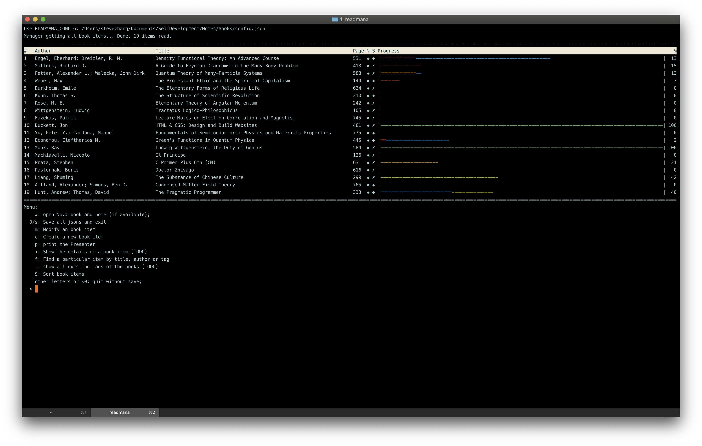

# **Read**ing **Mana**ger

[](https://travis-ci.org/minyez/readmanager)

## Motivation

`readmanager` is a simple manager for the personal reading, especially for books and note-taking.
DouBan provides only the way to mark the book you are reading or have read, 
but has no way to take care where you have been reading at present.
I have **always** been forgeting the books I am reading, as so many stuffs disturbing.
This is why I launch this project.

## Installation

Git clone `readmanager` to some local path `path/to/readmanager`
```
$ git clone git@github.com:minyez/readmanager.git path/to/readmanager
```
and add `path/to/readmanager` to your `PATH` and `PYTHONPATH` environment variables.

## Usage

Run
```bash
$ readmana
```
in terminal to start reading-manager. For help information, run
```bash
$ readmana -h
```

## Configuration

`readmana` uses a JSON file for configuration, default `~/.config/readmana/config.json`.
If it is not found and the environment variable `READMANA_CONFIG` is not set, 
`readmana` will interactively generate the default configuration file.
To use custom path, you need to specify a valid `READMANA_CONFIG`.

For now, the minimal `config.json` needs two keys, namely `dbJSON` and `dbNote`,
to specify the location of the datebase for book json files and notes, respectively.
The default `config.json` is
```json
{
    "dbJSON": "~/.local/share/readmana/JSON",
    "dbNote": "~/.local/share/readmana/note"
}
```
`dbJSON` and `dbNote` can be specified interactively when initializing the default `config.json`.
Particularly, they can both be set as `"-/"` to make `dbJSON` and `dbNote` refer to `JSON` and `note` diretories
in the same path as the configuration file.

## Book JSON example

See book JSONs in `test/data/JSON` for example.
To create JSON file for book item, the easiest way is to follow the instructions in `readmana`.
When creating, it will initialize all required keys for the reading-manager to work properly.
These keys are human-readable for you to modify them manually, but can also be modified by functions in `readmana`.

## TODO

- [x] sort items in manager instance by last modification time of books when loading
- [x] support item searching of author, title or tags of book
- [x] add short remarks for a book
- [ ] (!) non-interactive mode for unittest
- [ ] compatibility of showing Chinese for presenter class
- [ ] show all existing tags 
- [ ] marker for 3 most recent read
- [ ] archive method of manager class

## Screenshot


